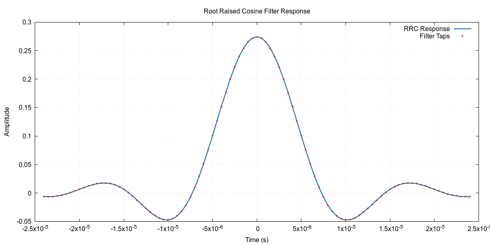

# rrc_gen

Root raised cosine filter generator. Generates H file for C integration or multidataset CSV for visualisation

 

## Build

   - run 'make' to build rrcg.

   - run 'make install' to install rrcg to $(HOME)/.local/bin


## Usage 

```
Usage: rrcg [OPTION...]

    -h           Prints this help
    -t value     Set the symbols per seconds to value
    -n value     Set number of taps per symbol to value
    -a value     Set alpha value to value
    -o filename  Write output to file filename

    --header     Generate a C header containing the filter def
    --normalize  Normalize filter so that total filter energy = 1
```

## Examples

```
./rrcg --normalize --header -o rrc_1 -t 125000 -n 16 -w 6 -a 0.35
```

Creates a '.h' file 'rrc_1.h' defining a 97tap filter.


```
./rrcg --normalize -o rrc_1 -t 125000 -n 16 -w 6 -a 0.35
```

Creates two csv files 'rrc_1.csv' and 'rrc_1_taps.csv' that can be plotted
using gnuplot as shown below. 

## ploting

``` 
set terminal pngcairo size 1200,600 enhanced font 'Arial,12'
set output 'rrc_filter.png'

set datafile separator ","
set grid
set xlabel "Time (s)"
set ylabel "Amplitude"
set title "Root Raised Cosine Filter Response"
set key top right

plot 'rrc_1.csv' using 1:2 with lines lw 2 lc rgb '#0060ad' title 'RRC Response', \
     'rrc_1_taps.csv' using 1:2 with points pt 7 ps 0.5 lc rgb '#dd181f' title 'Filter Taps'
```


